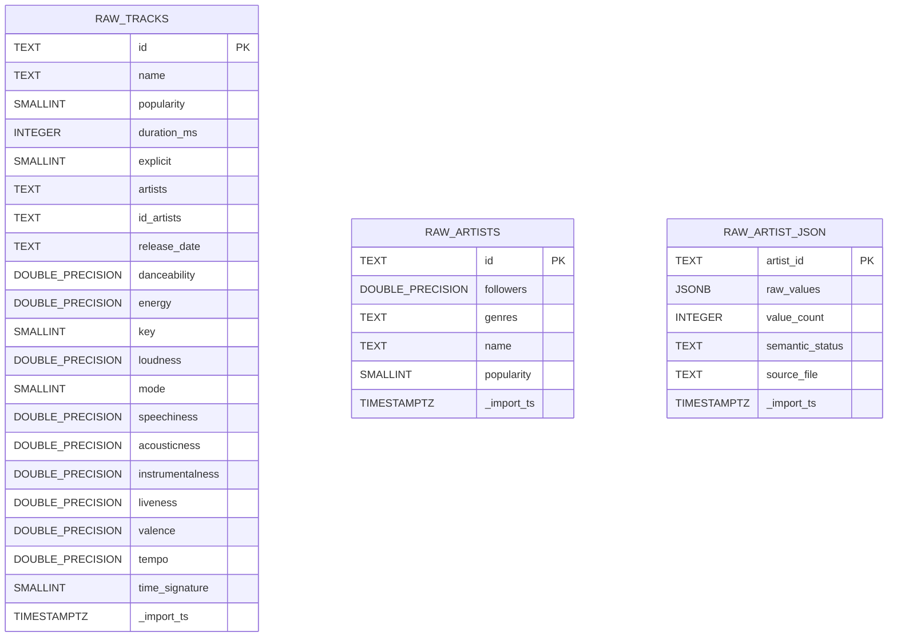
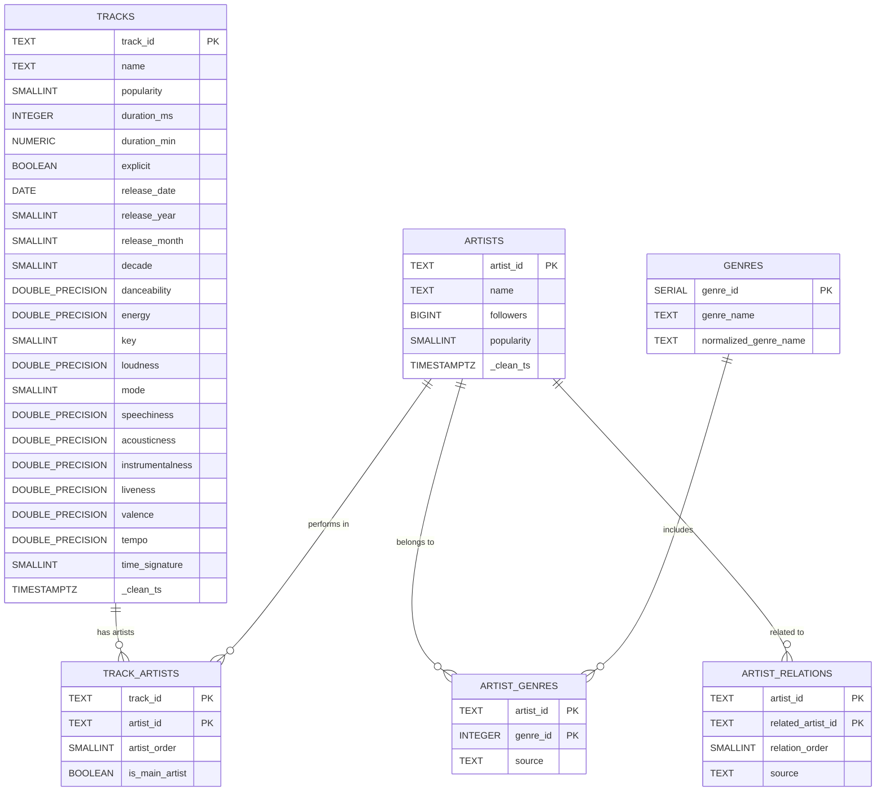
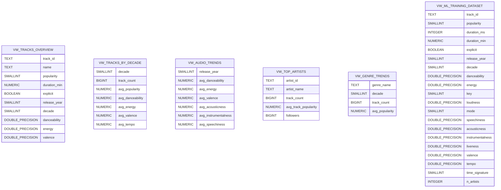
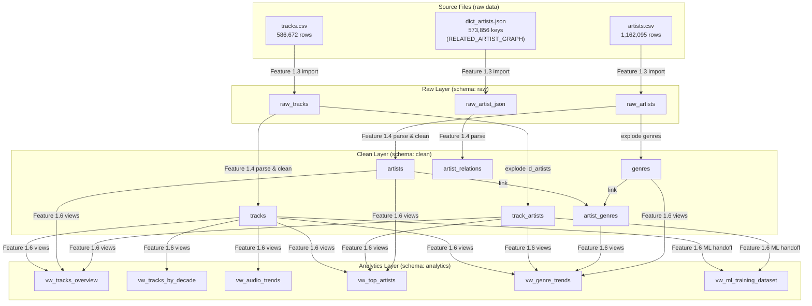

# ERD — HitRadar PostgreSQL Schema

> **Dự án:** HitRadar Pro | **Feature:** 1.2 — Database Architecture
> **Người thiết kế:** Đạt | **Ngày:** 2026-07-05

---

## 1. Raw Layer ERD

---

## 2. Clean Layer ERD

---

## 3. Analytics Layer (Views)

---

## 4. Cross-Layer Data Flow

