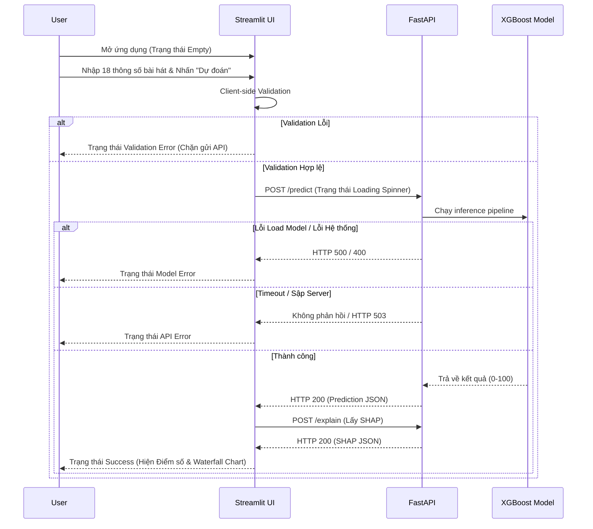

# GIAO DIỆN & TRẢI NGHIỆM NGƯỜI DÙNG (UI/UX CONTRACT)
**Tài liệu:** UI_UX_CONTRACT.md  
**Feature:** 3.0.5 - Chốt UI/UX contract  
**Ngày cập nhật:** 2026-07-28  

## 1. SƠ ĐỒ LUỒNG NGƯỜI DÙNG (USER FLOW)

## 2. CÁC TRẠNG THÁI GIAO DIỆN (STATES)
Streamlit UI phải xử lý toàn vẹn các trạng thái sau để đảm bảo trải nghiệm người dùng:

1. **Trạng thái Empty (Khởi tạo):**
   - Vùng kết quả dự đoán bị ẩn hoặc hiển thị "Vui lòng nhập thông số và nhấn Dự đoán".
   - Các nút submit ở trạng thái sẵn sàng.

2. **Trạng thái Loading:**
   - Khi đang chờ API trả về, hiển thị `st.spinner("Đang tính toán dự đoán và phân tích SHAP...")`.
   - Nút submit nên bị vô hiệu hóa (disable) để tránh spam click.

3. **Trạng thái Validation Error (Lỗi phía Frontend):**
   - Không gọi API.
   - Hiển thị `st.warning()` báo rõ trường nào sai (ví dụ: "Năm phát hành phải từ 1900 trở đi").

4. **Trạng thái API Error (Mất kết nối API):**
   - Không thể kết nối tới server (Connection Refused, Timeout).
   - Hiển thị `st.error("Lỗi: Không thể kết nối tới máy chủ dự đoán. Vui lòng đảm bảo FastAPI đang chạy ở Backend.")`.

5. **Trạng thái Model Error (Lỗi phía Backend):**
   - API trả về 500, 422, hoặc 400.
   - Hiển thị `st.error("Lỗi từ máy chủ: [Thông báo lỗi từ API]")`.

6. **Trạng thái Success:**
   - Hiện rõ con số dự đoán khổng lồ (Metrics).
   - Thanh tiến trình hoặc màu sắc (Đỏ = Flop, Vàng = Trung bình, Xanh = Hit).
   - Hiển thị biểu đồ giải thích SHAP Waterfall rõ ràng.

## 3. CẤU TRÚC ĐIỀU HƯỚNG (NAVIGATION)
1. **🏠 Home / Overview**
2. **🔮 Predict Popularity** 
3. **⚖️ What-If Simulator**
4. **📈 Music Trends (1921-2020)**
5. **ℹ️ Model Info**
6. **⚠️ Limitations & Ethics**
